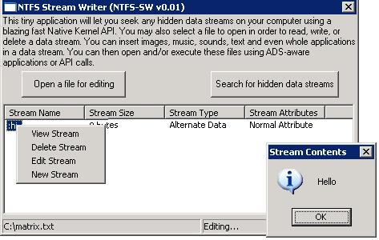



## UPDATED: NTFS Data Streams: the true way to hide information and extend your file system

### Description

11/10/2003: To celebrate my mother's birthday (to whom I shall dedicate this update to) I've decided to post a new version of the code. As posted in the recent article, all of the bugs and features that you have suggested have been implemented. Thank you very much for your comments! If you find any new bugs, please let me know!

This article will teach you about a big secret of the NT File System (NTFS): Alternate Data Streams. First off, a brief history about ADS will be offered, followed by practical applications of data streams, with examples. Finally, explanations on how to protect yourself from the dangers (and what they are) of ADS. Full source code is included as well as a GUI for scanning your disk for ADS, as well as editing and viewing them (or creating new ones). As a bonus, there are two versions, one in pure API, and one using VB controls. Finally, you can integrate this app in a VBS script, with very little modification, for server maintenance.
 
### More Info
 

             |
---                |---
**Submitted On**   |2003-08-11 13:46:42
**By**             |[Ion Alex Ionescu](https://github.com/Planet-Source-Code/PSCIndex/blob/master/ByAuthor/ion-alex-ionescu.md)
**Level**          |Advanced
**User Rating**    |5.0 (380 globes from 76 users)
**Compatibility**  |VB 4\.0 \(32\-bit\), VB 5\.0, VB 6\.0, VB Script
**Category**       |[Files/ File Controls/ Input/ Output](https://github.com/Planet-Source-Code/PSCIndex/blob/master/ByCategory/files-file-controls-input-output__1-3.md)
**World**          |[Visual Basic](https://github.com/Planet-Source-Code/PSCIndex/blob/master/ByWorld/visual-basic.md)
**Archive File**   |[UPDATED\_\_N1627918112003\.zip](https://github.com/Planet-Source-Code/ion-alex-ionescu-updated-ntfs-data-streams-the-true-way-to-hide-information-and-extend-you__1-47299/archive/master.zip)

### Source Code

<b>NTFS Alternate Data Streams (ADS)</b>

<i>What they are, and what they mean for you.</i>

<b>1. Introduction</b>

To properly introduce the
insertion of ADS support in NTFS, which started with Windows NT 3.1, we must
first take a look in the Macintosh world. As some of you might know, Macintosh
files do not generally have an extension. Yet, the OS is capable of recognizing
who made the application and properly execute it (along with coloring the file
based on your settings or other Mac features). This is possible because
Macintosh files have two “forks”. The resource fork, which contains this
information, and the data fork, which contains the executable code itself (as a
side note, this has changed in Mac OS X). When Windows NT 3.1 came out, it had
compatibility support for AppleTalk, meaning that NT and MacOS users could
easily exchange data. This caused a problem however, since there was no way to
copy the resource fork and the data fork of a file directly onto the NT file
system. Doing so would only copy the data fork, since the resource fork wasn’t
physically in the file, but in a separate stream. (In other words, the data and
resource fork don’t occupy the same cluster on disk, or are part of the same
contiguous file). Microsoft then had to implement NTFS ADS, which meant that NT
would see the resource fork as another stream, and would be able to copy it
along with the file onto a Macintosh computer. Extremely low-level and
inaccessible by most APIs or programs, ADS didn’t become popular until much
later.

<b>2. The dawn of ADS</b>

With Windows NT 4, ADS took on a
more important place in the heart of the NT OS. NT 4 started supporting Hard
Links (Hard Links is something from the Unix world, it’s the ability to
logically “map” a file or folder to another one. For example,
c:\mymusic\mp3\alex\rock\heavy\2002 can be mapped to C:\Heavy Rock 2002. While
this seems much like a shortcut, a shortcut is an extra file that the Shell has
to interpret. You cannot directly do file operations on a shortcut, and you
can’t use it in the command prompt. A Hard Link is a “physical shortcut”.) and
some anti-virus companies started writing checksums in a special ADS. However,
no official API was made for Hard Links, and checksum ADS were really rare. This
changed in Windows 2000.

<b>3. The golden age of ADS</b>

Windows 2000 brought a number of
new features to NTFS, sparse files, summary information data, ACLs and the
Encrypted File System, and an easy to use API to create hard links. All this
information is stored in the ADS of a file. For example, right-clicking on a
movie and going to properties allows you to enter information such as “Author,
Keyword, Title”. This information is not written in the file itself, but in an
ADS. Encrypting a file will also create a special ADS. Since ADS was becoming
more known, some viruses are also known to exploit ADS. Why? Because Microsoft
left a lot of holes in the implementation.

<b>4. What’s an ADS anyways?</b>

An alternate data stream, as
mentioned in the introduction, is any kind of data that can be attached TO a
file but not IN the file on an NTFS system. The Master File Table of the
partition will contain a list of all the data streams that a file contains, and
where their physical location on the disk is. Therefore, alternate data streams
are not present in the file, but attached to it trough the file table. A typical
file contains only a single data stream, called $DATA. This is the data
contained in the file itself, and is not an ALTERNATE data stream, since it is
the data stream itself. 

The convention that Microsoft
chose for file naming is the following: <i>
filename.extetsion:alternatedatastreamname:$DATA</i>. When you open a file, by
any normal means, you are therefore accessing the $DATA stream. Since there is
no alternate data stream, the file system actually opens
filename.extension::$DATA. If however this file had an alternate data stream
called “joe”, and you wanted to open it, you would have to open
filename.extension:joe:$DATA. I hope this is clear until now.

In the previous paragraphs, I
mentioned that an ADS can store Hard Links, Encryption, Summary Information,
etc. However, these are the uses that the OS has for an ADS. You, the user, can
create an infinity of ADS for your own usage. Let’s see why this is useful.

<b>5. What ADS mean for you</b>

If you understood everything
until now, you have noticed that ADS are not stored in the file itself. You
might be asking yourself “if I store 1MB worth of text into an ADS of a file,
will the file become 1MB bigger?” Here’s the great side about ADS…it won’t.
Since the data is never stored in the file itself, the APIs to retrieve the size
of the file will never take into account the ADS you might’ve added (or that the
OS added). Just like Explorer will only display and open the $DATA data stream
(the file itself), Explorer will only show the size of $DATA (the size of the
file itself). Explorer is not exhibiting a bug; any application calling the
normal Windows API will exhibit the same behavior. So what does this mean? It
means you can store 2 Gigabytes of data into the ADS of an empty file and that
the OS will display the file as empty. Opening this file with notepad will
result in a blank text page, and even a hex editor would display the file as
empty. The 2GB would however be shaved off your disk, and would you forget the
existence of this ADS, only a reformat would reclaim your space.

<b>6. Small summary</b>

To review what we’ve learnt till
now: An NTFS file is made of data streams. The main data stream, called $DATA is
the file itself and can be opened, read, written or otherwise modified by any
application. You will never see any mention of this data stream. The second type
of data stream is called an alternate data stream, or ADS. Any kind of
information can be stored in an ADS, and it will remain invisible to the user.
The data will never be seen when opening the file, and the file size of the file
will never change. An example of an OS-created ADS is the Summary Information
you can write about a file. A user can create any number of ADS he wants and
store whatever information inside.

<b>7. Clarifications (practical
example)</b>

I mention that a user will not
see an ADS, but that he can create them. I then say that an ADS will be
invisible to the user…what is the point then? You must be wondering, and this
chapter will offer an easy example so you can understand better. Suppose that
you have hundreds of passwords on numerous sites. You share the computer with
your roommate, who isn’t exactly a genius in computers, but would easily find
“passwords.txt”, or even something more “subtle”. Here’s a trick, using ADS,
that you can use. First, open notepad and paste some useless readme text. Save
this file to c:\readme.txt. Now, click on the start menu, then press run, and
type “notepad c:\readme.txt:passwords.txt”. Press OK. Notepad will ask if you
want to create the file, since it’s empty. Of course, Notepad is actually
referring to the data stream. Press OK, and then write down your passwords.
Close Notepad, and save the file when it asks you. Now for the test. Open
c:\readme.txt from explorer, or from Notepad or the Run command. You will see
your original readme text, with no mention of your passwords. Check the file
size in Explorer or DOS…it hasn’t changed. Now go back to the Run command, and
type “notepad c:\readme.txt:passwords.txt”. Notepad will open your passwords.
Now, assuming that you delete the Run previously-typed commands, your friend
will never have the idea of entering that command. Even if he knew about ADS,
how would he know which file you’ve stored it in, or what you’ve called your
ADS? If you want, you can also try running “notepad
c:\windows\explorer.exe:passwords.txt” and write your information there. Windows
and Explorer will run fine, yet your passwords will be linked to explorer.exe. I
don’t suggest you do that in this example, since the only way to delete the ADS
is to delete the file itself (or use my program…)

<b>8. Malicious usage</b>

“So wait…if *I* can store hidden
information on my own computer…can’t a hacker or a Trojan horse program store
information or even executable code in ADS? Can’t a joker create a 5GB file on
my computer without me ever finding out?” Unfortunately, the answer to all those
questions is yes. Executable code can be placed in an ADS, and even executed,
without ever touching the host program. That’s right… using API or the “Start”
command in DOS, you can execute “Explorer.exe:Trojan.exe”. What this will do is
execute the Trojan program, without Explorer ever running. To make matters
worse, Windows 2000 displays “Explorer.exe” in Task Manager, not “Trojan.exe”.
Thankfully, XP has fixed this horrible security bug. (but it still only shows
explorer.exe:Trojan.exe…you could call the file something less conspicuous).
This is NOT a tutorial on how to use ADS to hack, so I will not give any details
on how to copy executable code or running it. Unfortunately, a Trojan might’ve
already done that on your system, or a more computer-savvy “friend”. Here’s the
good news: Using Kernel Native APIs and the Backup APIs, it is possible to
rapidly seek out any ADS on your hard drive, as well as read/write to them, or
delete them. 

<b>9. My program</b>

The program attached is a fully
working example, complete with comments about almost every line. It is written
in pure API, so even the Form itself is created using API, not the Visual Basic
Designer. I’ve done this for speed, and also to teach you a bit more about API
controls. You can see in the screenshot that it doesn’t look bad at all. The
application is split into modules, so if you simply want to include Stream
functionality in your application, you can use the StreamModule.

<b>10. Final notes</b>

I greatly recommend compiling
the application into a Native EXE for much faster speed. It should take less
then two minutes to scan your whole disk (It takes me 30 seconds, but I have a
fast CPU and HD so I’m estimating). If you find any suspicious ADS (you will be
able to see their name) or huge sizes (you will also see the size), you can use
the Open button to delete malicious ones, or simply to view/edit the ones you
are wondering about. Finally, you can create your own ADS. For security reasons,
my program only allows you to write clear-text ADS, not executable ones.

Enjoy! This is my first big
article, so if you find it too hard to understand, please don’t hesitate to
write your comment down. If you have any trouble, or any other comment, also
feel free to write it. I will happily accept any criticism or ideas =) I’m only
17 years old so sorry if my English isn’t spotless (It’s my third language).

<b>FAQ (Frequently Asked
Questions) </b>

<b>1. Why can’t the Message Box
show executable streams? </b>

<i>As I said before, this
project doesn’t support binary streams for security reasons. The module is very
clearly written and you can always use different methods to display the buffer
containing the data if you wish, after calling ViewStream.</i>

<i> </i><b>2. Why are there two
projects? What’s _NOAPI? </b>

<i>Because some people might
just be interested in the StreamModule itself and the framework used to
manipulate ADS, I have included a project made with VB’s designer and using OCX
files that come with VB. This project has the suffix _NOAPI. While it’s meant
for beginners, I strongly recommend even intermediate programmers to look at the
API version. It’s much faster because of the list view and status bar being in
API. </i>

<b>3. The _NOAPI version only
contains a form with some code, and the StreamModule… why does it make a bigger
EXE then the API version, which has 4 modules filled with code?</b>

<i>Just because VB’s designer
hides the code for you doesn’t mean it’s there. My API implementation is faster
and cleaner then what VB does in the background. And it needs no OCX files at
all.</i>

<b> 4. I am an advanced
programmer or server admin, what are the advantages of using the API version?</b>

<i>Firstly, you will notice that
the scanning is much faster (almost twice as fast), unless you remove the status
bar refresh on each file (but then your application will look hung for two
minutes). Secondly, the API version is 36kb, plus the 1MB VB6 runtime. The
_NOAPI version is 40kb, plus the 1MB VB6 runtime, plus the comdlg32.ocx, plus
the comctl32.ocx, all together totaling over 2MB. </i>

<i>Finally, using one of the
many API-Call add-ons for VBScript, you can create an automated VBS file that
will scan your server or active directory for any streams, based on your
criteria, all while showing the same GUI as in my VB example, since it was all
created in API.</i>

